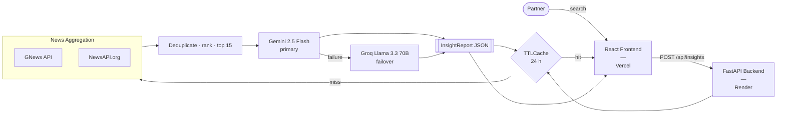

# Bain Intelligence

> Internal use only &mdash; not for distribution.

Bain Intelligence is an internal research tool that delivers on-demand, PE-grade company briefings in seconds. Enter any company name and the platform aggregates live news from multiple sources, then uses Gemini 2.5 Flash to synthesize a structured brief covering executive summary, bull and bear cases, strategic themes, risk flags, and value creation hypotheses — the same analytical dimensions a deal team would assemble ahead of a client meeting or diligence sprint. Built for Bain partners who need rapid commercial context without the manual overhead, the tool eliminates the cold-start research problem and surfaces signal before the first conversation.

---

## Architecture



---

## Tech Stack

| Layer | Technology |
|---|---|
| **Frontend** | React 19, TypeScript (strict), Vite 6, Tailwind CSS v4, TanStack Query v5 |
| **Backend** | Python 3.12, FastAPI, uvicorn, httpx, pydantic-settings |
| **LLM — primary** | Gemini 2.5 Flash (google-genai SDK, structured JSON output) |
| **LLM — failover** | Groq Llama 3.3 70B (OpenAI-compatible client) |
| **News sources** | GNews API, NewsAPI.org (server-side only, concurrent fetch) |
| **Caching** | cachetools TTLCache — 24 h, keyed on company name |
| **Resilience** | tenacity retry with exponential backoff; 429-aware failover to Groq |
| **Testing** | pytest + pytest-asyncio (backend), Vitest + React Testing Library (frontend) |
| **Linting** | ruff (Python), ESLint + Prettier (TypeScript) |
| **CI/CD** | GitHub Actions — lint, test, deploy on push to `main` |
| **Hosting** | Vercel (frontend), Render (backend) |

---

## Local Setup

### 1. Clone the repository

```bash
git clone https://github.com/Invenator/Bain-and-Company-insights.git
cd Bain-and-Company-insights
```

### 2. Backend

```bash
cd backend
python -m venv venv && source venv/bin/activate
pip install -r requirements.txt
```

Create a `.env` file in `backend/` with the following keys:

```env
GNEWS_API_KEY=your_key
NEWS_API_KEY=your_key
GEMINI_API_KEY=your_key
GROQ_API_KEY=your_key
```

```bash
uvicorn app.main:app --reload
# API available at http://localhost:8000
```

### 3. Frontend

```bash
cd frontend
npm ci
npm run dev
# App available at http://localhost:5173
```

> The Vite dev server proxies `/api` to `localhost:8000` automatically. Set `VITE_API_BASE_URL` only for non-local deployments.

---

## Cost Analysis

The current deployment runs entirely on free tiers. At meaningful partner query volume, Gemini token consumption and GNews API calls are the primary cost drivers.

| Component | Current (demo) | 1,000 queries / day |
|---|---|---|
| Gemini 2.5 Flash | Free tier (15 RPM) | ~$35 USD / mo |
| GNews API | Free (100 req / day) | ~$10 USD / mo |
| Groq Llama 3.3 70B | Free tier (failover only) | ~$0 |
| Vercel | Free (Hobby) | Free |
| Render | Free (cold starts) | ~$7 USD / mo (Starter) |
| **Monthly total** | **$0** | **~$52 USD (~70 CAD) / mo** |

> The 24-hour TTLCache meaningfully reduces LLM calls at scale — repeated queries for the same company within a day are served from cache at no cost.

---

## Limitations

This tool is designed for rapid orientation, not rigorous diligence. Understand the constraints before acting on a brief.

- **Public news only.** All signal comes from GNews and NewsAPI — both aggregate publicly available journalism. Proprietary sources (Bloomberg Terminal, Refinitiv Eikon, Bain internal databases, sell-side research) are not integrated. Privately held companies with limited press coverage will return thin or unreliable briefs.
- **~30-day recency window.** Both APIs surface recent news only. The synthesis reflects the current narrative, not historical performance arcs or multi-year strategic trajectories.
- **English-language press only.** Both news calls are hardcoded to `lang: "en"`. Coverage of companies whose primary press is in Japanese, German, Mandarin, or other languages will be materially incomplete.
- **15-article ceiling.** The pipeline caps context at 15 deduplicated articles. For high-volume news subjects, significant coverage is discarded before synthesis.
- **No primary research.** There are no expert network calls, no channel checks, no customer interviews, and no earnings call transcripts. Every insight is a derivative of published secondary sources.
- **24-hour cache introduces staleness risk.** A breaking event for a company queried earlier that day will not surface until cache expiry.
- **Not a substitute for due diligence.** The tool surfaces hypotheses and orientation — not investment conclusions. All outputs should be treated as directional context for meeting preparation, and verified against audited financials, primary interviews, and structured commercial diligence before any investment decision.

---

## Future Enhancements

The following represent natural extensions as the tool moves from PoC to production platform.

- **Peer-company comparison view.** A side-by-side InsightCard layout would allow partners to run parallel briefs on two or three companies and surface competitive differentiation at a glance — useful ahead of portfolio reviews or sector scans.
- **Vector DB for longitudinal tracking.** Persisting reports to a vector store (e.g. Pinecone, Weaviate) would enable semantic retrieval of historical briefs, allowing the tool to surface how a company's risk profile or strategic narrative has shifted over time.
- **Multi-language support via GDELT.** Integrating the GDELT Project — a free, near-real-time dataset covering global events in 65+ languages — would materially improve coverage of non-Anglophone companies and emerging market targets.
- **Expert transcript ingestion.** Tegus-style ingestion of expert network call transcripts would add primary research signal to the synthesis layer, grounding LLM output in channel-checked perspectives rather than press coverage alone.
- **Financial data integration.** Layering in quantitative context from public filings or market data APIs (e.g. Alpha Vantage, SEC EDGAR) would allow the brief to anchor qualitative themes against revenue, margin, and growth metrics.

---

## Live Demo

| | URL |
|---|---|
| **Frontend** | https://bain-and-company-insights.vercel.app |
| **Backend health** | https://bain-and-company-insights-api.onrender.com/health |
